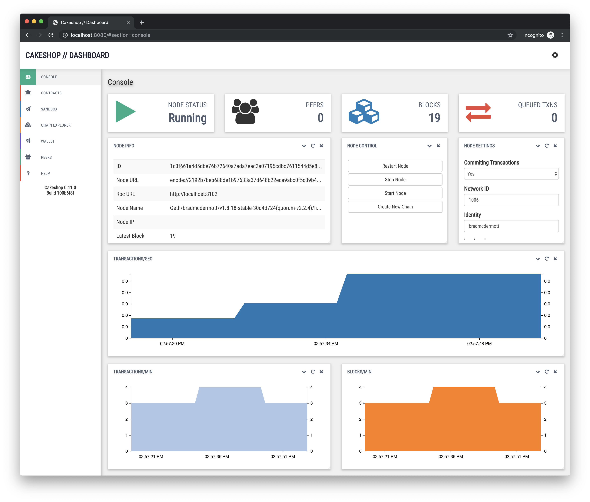
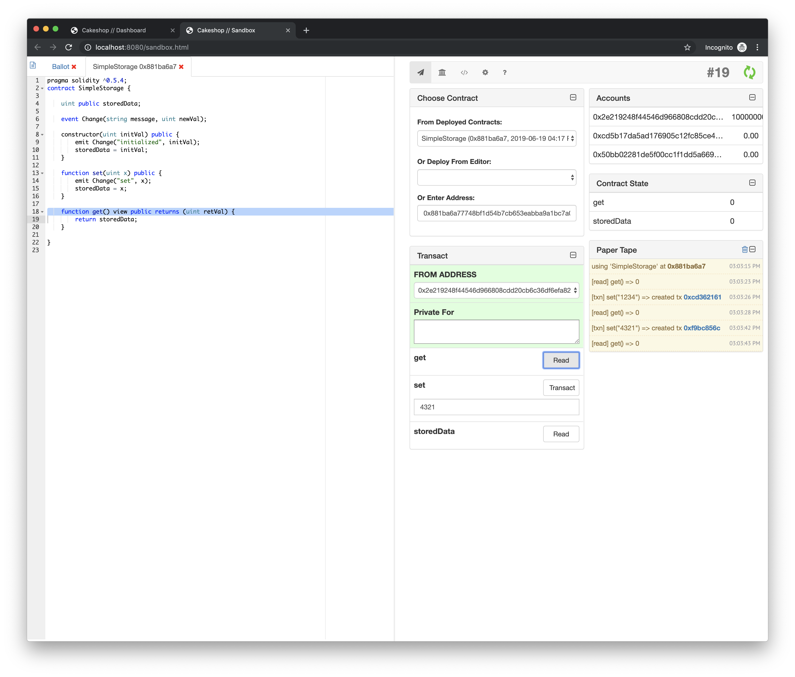

# Cakeshop

_Cakeshop_ is a set of tools and APIs for working with GoQuorum nodes, packaged as a Java web application archive (WAR) that gets you up and running in under 60 seconds.

It provides tools for attaching to GoQuorum nodes, exploring the state of the chain, and working with contracts.

Cakeshop can be used with the [quorum-dev-quickstart](https://github.com/ConsenSys/quorum-dev-quickstart). We encourage users interested in testing Cakeshop to use quorum-dev-quickstart.






## Download

Binary packages are available on the [Github releases page](https://github.com/ConsenSys/cakeshop/releases).

## Configuration

Cakeshop is a Spring Boot application, so you may place an `application.properties` file in the working directory to override any default configuration values. For more info, see the [configuration page](docs/configuration.md).

## Running with the [Quorum Dev Quickstart](https://github.com/ConsenSys/quorum-dev-quickstart)

### Requirements

* You must have a running GoQuorum network using the [Quorum Dev Quickstart](https://github.com/ConsenSys/quorum-dev-quickstart)

### Running

* git clone git@github.com:ConsenSys/cakeshop.git
* cd `cakeshop/quorum-dev-quickstart`
* Run `docker-compose up -d`
* Navigate to [http://localhost:8999/](http://localhost:8999/)
* Stop cakeshop with `docker-compose down`


## Running via Spring Boot

### Requirements

* Java 11+
* NodeJS (if the nodejs binary on your machine isn't called 'node', see [here](docs/configuration.md#cakeshop-internals))

### Running

* Download WAR file
* Run `java -jar cakeshop.war`
* Navigate to [http://localhost:8080/](http://localhost:8080/)


## Running via Docker

Simple example of running via docker on port 8080:

```sh
docker run -p 8080:8080 quorumengineering/cakeshop
```

Then access the UI at [http://localhost:8080/](http://localhost:8080/)

### Docker Customizations
You can add some extra flags to the run command to further customize cakeshop.

Here is an example where you mount `./data` as a data volume for the container to use:

```sh
mkdir data
docker run -p 8080:8080 -v "$PWD/data":/opt/cakeshop/data quorumengineering/cakeshop
```

An example providing an initial nodes.json in the data directory and configuring it to be used:

```sh
# makes sure you have nodes.json at $PWD/data/nodes.json
docker run -p 8080:8080 -v "$PWD/data":/opt/cakeshop/data \
    -e JAVA_OPTS="-Dcakeshop.initialnodes=/opt/cakeshop/data/nodes.json" \
    quorumengineering/cakeshop
```

## Migrating from Cakeshop v0.11.0

The following big changes were made in v0.12.0:
1. Simplification of config file to better follow Spring Boot standards.
2. Moved Contract Registry from being stored in a combination of a smart contract and the database to being in the database only.
3. Elimination of cakeshop's managed node in favor of only attaching to existing nodes.
4. Simplified DB configuration by using Spring Data.

To ensure easy transition, Cakeshop will still look in the locations where v0.11.0 commonly stored the config file. But (1) allows you to now place your config in the folder where you run cakeshop, or specify a different location using standard spring boot flags, for easier customization.

Cakeshop had custom logging location logic in the config before this change, which was removed. You may now redirect logs yourself or use Spring's logging config settings.

For (2), if you had contracts deployed and stored in the old Contract Registry, you may leave the `contract.registry.addr` line in your config file. Cakeshop will look for that contract address when it connects to the network and add those contracts to the database.

For (3), most of the original config values were related to this feature, and can be safely removed. See the [default config file](../cakeshop-api/src/main/resources/config/application.properties) for all the values that are actually used.

(4) means that you will need to update the db-related config values to use spring data. So the old `cakeshop.database`, `cakeshop.hibernate`, and `cakeshop.jdbc` settings should change to use `spring.data`, `spring.jpa`, etc. See the [configuration](docs/configuration.md#database) doc for more info.

Note: Due to an bug that happens when you update from Hibernate 4 to 5, when auto-updating the database it will try to recreate some column constraints that don't need to be recreated. These will fail and print a stack trace in the logs because they already exist. There are no negative effects from this error, so the best thing to do is to run with `spring.jpa.hibernate.ddl-auto=update` once and then change `update` to `none` on subsequent runs to avoid error logs. In production, it is not recommended to use auto-update to migrate your database at all, but instead run migrations on the database yourself.

## Further Reading

Further documentation can be found [here](https://docs.goquorum.consensys.net/en/stable/Concepts/Cakeshop/).

## See Also

* [JIF Dashboard](https://github.com/jpmorganchase/jif-dashboard) - The Cakeshop UI was built using the JIF Dashboard framework.

* [solc-cakeshop-cli](https://github.com/ConsenSys/solc-cakeshop-cli) - The solidity compiler used behind the scenes is `solc-cakeshop-cli`, a thin wrapper atop the [solc](https://github.com/ethereum/solc-js) JS binding.

## Contributing

Thank you for your interest in contributing to Cakeshop!

Cakeshop is built on open source and we invite you to contribute enhancements. Upon review you will be required to complete a Contributor License Agreement (CLA) before we are able to merge. If you have any questions about the contribution process, please feel free to send an email to [info@goquorum.com](mailto:info@goquorum.com).


## Reporting Security Bugs
Security is part of our commitment to our users. At Quorum we have a close relationship with the security community, we understand the realm, and encourage security researchers to become part of our mission of building secure reliable software. This section explains how to submit security bugs, and what to expect in return.

All security bugs in [GoQuorum](https://github.com/ConsenSys/quorum) and its ecosystem ([Tessera](https://github.com/ConsenSys/tessera), [Constellation](https://github.com/ConsenSys/constellation), [Cakeshop](https://github.com/ConsenSys/cakeshop), ..etc)  should be reported by email to [info@goquorum.com](mailto:info@goquorum.com). Please use the prefix **[security]** in your subject. This email is delivered to the Quorum security team. Your email will be acknowledged, and you'll receive a more detailed response to your email as soon as possible indicating the next steps in handling your report. After the initial reply to your report, the security team will endeavor to keep you informed of the progress being made towards a fix and full announcement.

If you have not received a reply to your email or you have not heard from the security team please contact any team member through quorum slack security channel. **Please note that Quorum slack channels are public discussion forum**. When escalating to this medium, please do not disclose the details of the issue. Simply state that you're trying to reach a member of the security team.

#### Responsible Disclosure Process
Quorum project uses the following responsible disclosure process:

- Once the security report is received it is assigned a primary handler. This person coordinates the fix and release process.
- The issue is confirmed and a list of affected software is determined.
- Code is audited to find any potential similar problems.
- If it is determined, in consultation with the submitter, that a CVE-ID is required, the primary handler will trigger the process.
- Fixes are applied to the public repository and a new release is issued.
- On the date that the fixes are applied, announcements are sent to Quorum-announce.
- At this point you would be able to disclose publicly your finding.

**Note:** This process can take some time. Every effort will be made to handle the security bug in as timely a manner as possible, however it's important that we follow the process described above to ensure that disclosures are handled consistently.  

#### Receiving Security Updates
The best way to receive security announcements is to subscribe to the Quorum-announce mailing list/channel. Any messages pertaining to a security issue will be prefixed with **[security]**.

Comments on This Policy
If you have any suggestions to improve this policy, please send an email to info@goquorum.com for discussion.

## License

Copyright (c) 2016-2021 Consensys and/or applicable contributors

Licensed under the Apache License, Version 2.0 (the "License");
you may not use this file except in compliance with the License.
You may obtain a copy of the License at

     http://www.apache.org/licenses/LICENSE-2.0

Unless required by applicable law or agreed to in writing, software
distributed under the License is distributed on an "AS IS" BASIS,
WITHOUT WARRANTIES OR CONDITIONS OF ANY KIND, either express or implied.
See the License for the specific language governing permissions and
limitations under the License.

See the [LICENSE](LICENSE) and [THIRD_PARTY](THIRD_PARTY) files for additional license information.

# Getting Help
Stuck at some step? Please join our <a href="https://www.goquorum.com/slack-inviter" target="_blank" rel="noopener">slack community</a> for support.
